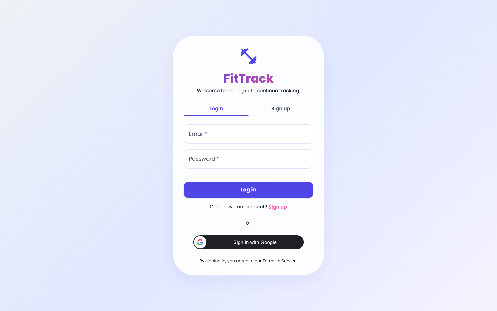
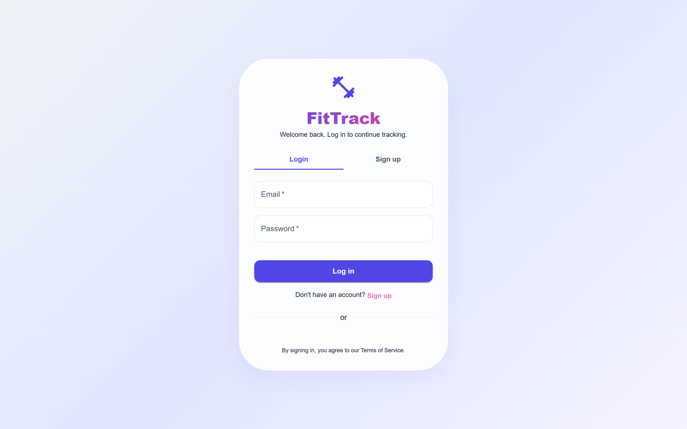
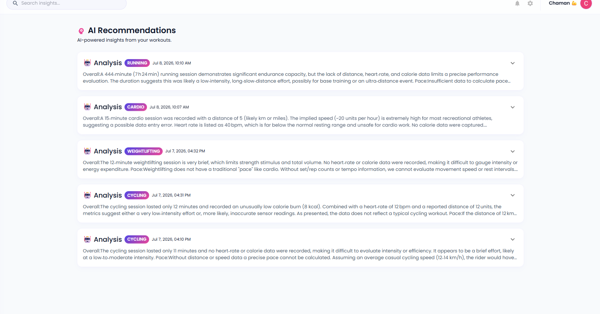
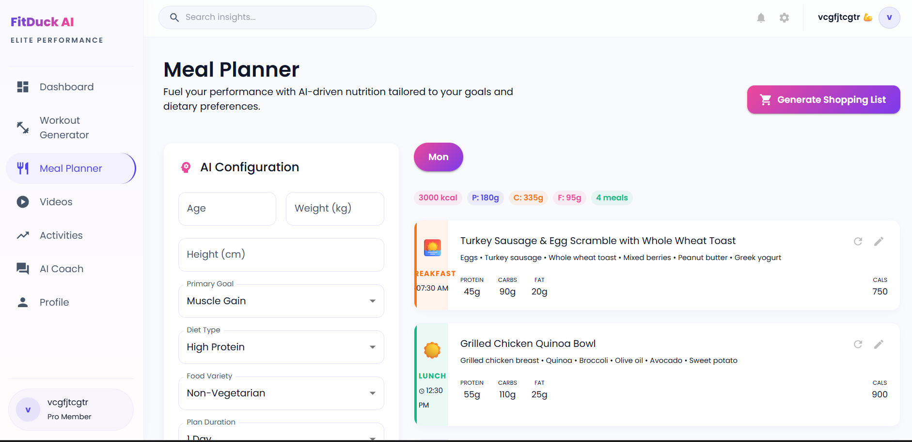
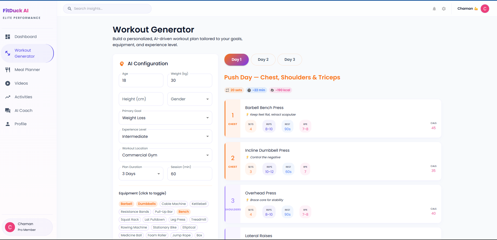
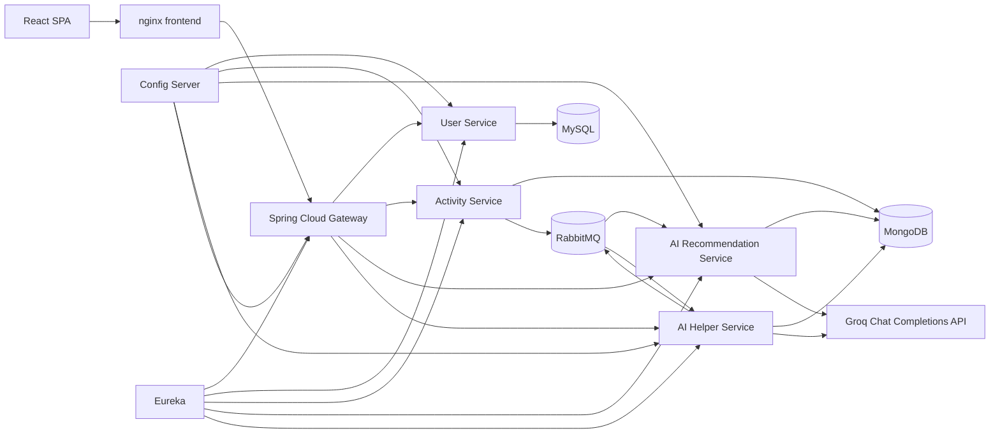
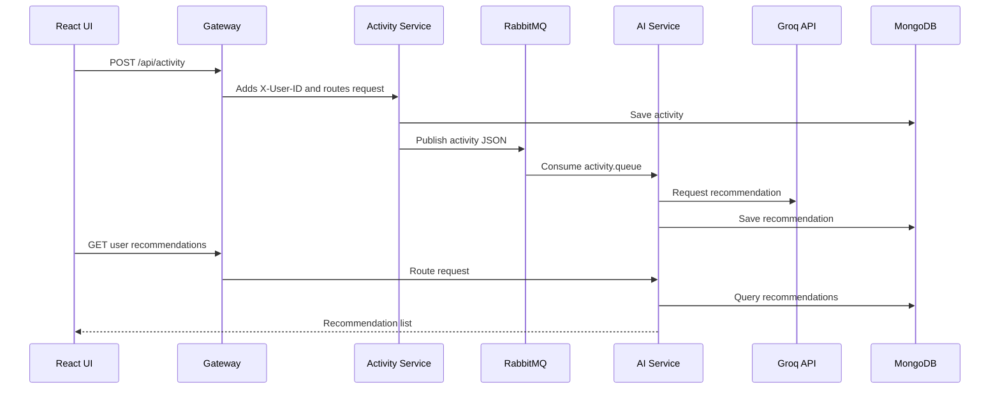

<div align="center">
  
  <h1>FitTrack Microservices</h1>
  <p><strong>AI-assisted fitness tracking, meal planning, workout generation, and activity recommendations built with Spring Boot microservices and React.</strong></p>

  <p>
    
    
    
    
    
    
  </p>

  
</div>

## Table Of Contents

- [Project Overview](#project-overview)
- [Why This Project Exists](#why-this-project-exists)
- [Key Features](#key-features)
- [Screenshots](#screenshots)
- [Architecture Overview](#architecture-overview)
- [Technology Stack](#technology-stack)
- [Folder Structure](#folder-structure)
- [Installation Guide](#installation-guide)
- [Local Development](#local-development)
- [Docker Deployment](#docker-deployment)
- [Docker Compose](#docker-compose)
- [Kubernetes Deployment](#kubernetes-deployment)
- [Environment Variables](#environment-variables)
- [API Overview](#api-overview)
- [Database Overview](#database-overview)
- [Security Features](#security-features)
- [Monitoring And Logging](#monitoring-and-logging)
- [AI Workflow](#ai-workflow)
- [Future Roadmap](#future-roadmap)
- [Contributing](#contributing)
- [License](#license)
- [Contact](#contact)

## Project Overview

FitTrack Microservices is a full-stack fitness platform split into independent services for authentication, user profiles, activity tracking, AI recommendations, AI meal plans, and AI workout plans. The frontend is a React and Vite single-page application served by nginx in production. Backend traffic flows through a Spring Cloud Gateway that authenticates users, injects a trusted `X-User-ID` header, and routes requests to downstream services.

The repository includes Dockerfiles for each service, a Docker Compose deployment, Kubernetes manifests for Minikube-style deployments, k6 smoke/load scripts, and real UI screenshots captured from the frontend.

## Why This Project Exists

This project demonstrates how a fitness product can be decomposed into deployable services while still supporting a cohesive user experience:

| Goal | Implementation |
| --- | --- |
| Separate user, activity, and AI responsibilities | Spring Boot services with independent data models |
| Keep browser auth safer | Gateway-issued httpOnly `app_jwt` cookie |
| Support async AI processing | RabbitMQ queues for activity recommendations, meal plans, and workout plans |
| Use fit-for-purpose storage | MySQL for users, MongoDB for activity and generated AI documents |
| Ship deployable artifacts | Docker Compose and Kubernetes manifests |

## Key Features

- Email/password signup and login through the gateway.
- Google ID-token exchange flow that upserts a user profile and sets an httpOnly session cookie.
- Activity logging with duration, calories, start time, type, and flexible metrics.
- AI recommendations generated from activity events through RabbitMQ.
- AI meal-plan generation with async `PENDING`, `COMPLETED`, and `FAILED` lifecycle states.
- AI workout-plan generation with exercise details, equipment, experience level, and location preferences.
- Protected React dashboard, activity history, recommendations, meal planner, workout generator, and videos pages.
- nginx proxying for `/api` in containerized frontend deployments.
- Docker Compose and Kubernetes service definitions for the microservice stack.

## Screenshots

| Login | Dashboard |
| --- | --- |
|  |  |

| Activities | Recommendations |
| --- | --- |
|  |  |

| Meal Planner | Workout Generator |
| --- | --- |
|  |  |

## Architecture Overview



See [PROJECT_ARCHITECTURE.md](docs/PROJECT_ARCHITECTURE.md) and [SYSTEM_DESIGN.md](docs/SYSTEM_DESIGN.md) for deeper diagrams and request flows.

## Technology Stack

| Layer | Technology |
| --- | --- |
| Frontend | React 19, Vite 8, Material UI 9, Axios, React Router |
| API gateway | Spring Cloud Gateway WebFlux, Spring Security, Nimbus JOSE JWT |
| Backend services | Java 17, Spring Boot 4.0.1, Spring Cloud 2025.1.0 |
| Persistence | MySQL through Spring Data JPA, MongoDB through Spring Data MongoDB |
| Messaging | RabbitMQ direct exchanges and durable queues |
| AI provider | Groq OpenAI-compatible chat completions endpoint |
| Deployment | Docker, Docker Compose, nginx, Kubernetes manifests |
| Testing utilities | Spring Boot test skeletons, k6 smoke and load scripts |

## Folder Structure

| Path | Purpose |
| --- | --- |
| `frontend/` | React/Vite SPA, nginx config, screenshot capture script, frontend Dockerfile |
| `gateway/` | Spring Cloud Gateway, auth endpoints, cookie JWT, route definitions, CORS config |
| `userservice/` | User registration, login, profile lookup, MySQL/JPA `users` table |
| `activity-status/` | Activity tracking API, MongoDB `activities`, RabbitMQ publisher |
| `aiservice/` | Activity recommendation consumer/API, MongoDB `recommendations`, Groq integration |
| `Aihelper/` | Meal-plan and workout-plan generation APIs, queues, MongoDB documents |
| `configserver/` | Spring Cloud Config Server with native YAML config files |
| `eureka/` | Eureka service registry |
| `kubernetes/` | Namespace, secrets example, ConfigMap, Deployments, Services, Ingress |
| `k6/` | Smoke and load test scripts |
| `docs/` | Architecture, API, database, deployment, security, workflow, and image assets |

## Installation Guide

Prerequisites:

- Java 17.
- Maven wrapper support through each service's `mvnw` or `mvnw.cmd`.
- Node.js 20 or newer for the frontend.
- Docker and Docker Compose for container deployment.
- External MySQL-compatible database and MongoDB connection if running the full backend.
- RabbitMQ if running services outside Compose/Kubernetes.

Clone and install frontend dependencies:

```bash
git clone <repository-url>
cd fitness_web_microservices/frontend
npm install
```

Build an individual Java service:

```bash
cd userservice
./mvnw clean package
```

On Windows PowerShell:

```powershell
cd userservice
.\mvnw.cmd clean package
```

## Local Development

Start core backend services in dependency order:

1. RabbitMQ.
2. Eureka on `8761`.
3. Config Server on `8888`.
4. User Service on `8081`.
5. Activity Service on `8082`.
6. AI Service on `8083`.
7. AI Helper on `8084`.
8. Gateway on `8080`.
9. Frontend on `5173`.

Frontend development:

```bash
cd frontend
npm run dev
```

The Vite dev server proxies `/api` to `http://localhost:8080`.

## Docker Deployment

Each Java service uses a multi-stage Dockerfile:

- `maven:3.9-eclipse-temurin-17` builds the jar.
- `eclipse-temurin:17-jre-alpine` runs the jar.
- `curl` is installed for container health checks.

The frontend Dockerfile builds with `node:20-alpine` and serves the static bundle through `nginx:alpine`.

## Docker Compose

Start the published-image stack:

```bash
docker compose up -d
```

Compose starts RabbitMQ, Eureka, Config Server, all backend services, the gateway, and the frontend. The frontend publishes port `80:80`; internal service ports are used inside the Compose network.

See [DOCKER.md](docs/DOCKER.md) for service order, health checks, ports, and resource limits.

## Kubernetes Deployment

Kubernetes manifests are available under `kubernetes/` for the `fittrack` namespace. They include:

- RabbitMQ Deployment and Service.
- Eureka Deployment and Service.
- Config Server Deployment and Service.
- User, Activity, AI, AI Helper, Gateway, and Frontend Deployments and Services.
- nginx ConfigMap for frontend `/api` proxying.
- Secret example for database, OAuth, JWT, and AI keys.
- Ingress for `fittrack.local`.

See [KUBERNETES.md](docs/KUBERNETES.md) for deployment commands and manifest details.

## Environment Variables

| Variable | Used by | Purpose |
| --- | --- | --- |
| `PORT` | All Spring services | Overrides service port |
| `CONFIG_HOST` | Spring services | Config Server host |
| `EUREKA_HOST` | Spring services | Eureka host |
| `USER_SERVICE_URL` | Gateway | User service route/upstream |
| `ACTIVITY_SERVICE_URL` | Gateway | Activity service route/upstream |
| `AI_SERVICE_URL` | Gateway | Recommendation service route/upstream |
| `AIHELPER_SERVICE_URL` | Gateway | Meal/workout service route/upstream |
| `RABBITMQ_HOST`, `RABBITMQ_PORT`, `RABBITMQ_USERNAME`, `RABBITMQ_PASSWORD` | Activity, AI, AI Helper | RabbitMQ connection |
| `CORS_ALLOWED_ORIGINS` | Gateway | Comma-separated browser origins |
| `SPRING_DATASOURCE_URL`, `DB_USERNAME`, `DB_PASSWORD` | Kubernetes secret example / deployment env | MySQL connection values |
| `MONGODB_URI` | Kubernetes secret example / deployment env | MongoDB connection value |
| `GOOGLE_CLIENT_ID`, `GOOGLE_CLIENT_SECRET` | Kubernetes secret example / Gateway env | Google auth configuration |
| `APP_JWT_SECRET` | Kubernetes secret example / Gateway env | App JWT signing secret |
| `GEN_AI_KEY` | Kubernetes secret example / AI services env | Groq API key |

The checked-in Config Server YAML currently contains hardcoded database and Groq credentials. Treat those as compromised and rotate them before using this project outside a local demo.

## API Overview

| Service | Endpoint | Auth | Description |
| --- | --- | --- | --- |
| Gateway | `POST /api/auth/register` | Public | Email signup and app session creation |
| Gateway | `POST /api/auth/login` | Public | Email login and app session creation |
| Gateway | `POST /api/auth/google` | Public | Google ID-token exchange and app session creation |
| Gateway | `POST /api/auth/logout` | Public | Clears the session cookie |
| Gateway | `GET /api/auth/me` | Cookie | Returns current user |
| User Service | `GET /api/user/{userId}` | Gateway-routed | Returns a user profile |
| User Service | `GET /api/user/{userId}/validate` | Gateway-routed/internal | Checks whether user ID exists |
| Activity Service | `POST /api/activity` | Cookie through gateway | Creates an activity and publishes a RabbitMQ event |
| Activity Service | `GET /api/activity` | Cookie through gateway | Lists activities for `X-User-ID` |
| AI Service | `GET /api/recommendation/user/{userId}` | Cookie through gateway | Lists recommendations for a user |
| AI Service | `GET /api/recommendation/activity/{activityId}` | Cookie through gateway | Gets recommendation for one activity |
| AI Helper | `POST /api/mealplan` | Cookie through gateway | Starts async meal plan generation |
| AI Helper | `GET /api/mealplan/{id}` | Cookie through gateway | Fetches one meal plan |
| AI Helper | `GET /api/mealplan/user/{userId}` | Cookie through gateway | Lists meal plans by user |
| AI Helper | `POST /api/mealplan/{planId}/day/{dayIndex}/meal` | Cookie through gateway | Adds a custom meal to a day |
| AI Helper | `POST /api/workoutplan` | Cookie through gateway | Starts async workout plan generation |
| AI Helper | `GET /api/workoutplan/{id}` | Cookie through gateway | Fetches one workout plan |
| AI Helper | `GET /api/workoutplan/user/{userId}` | Cookie through gateway | Lists workout plans by user |

Full request and response shapes are documented in [API_DOCUMENTATION.md](docs/API_DOCUMENTATION.md).

## Database Overview

| Store | Collections/Tables |
| --- | --- |
| MySQL | `users` |
| MongoDB | `activities`, `recommendations`, `meal_plans`, `workout_plans` |

Repository query methods define lookups by `email`, `userId`, and `activityId`. No explicit Mongo indexes are declared in the code. The `users.email` column is unique through JPA annotations.

See [DATABASE_DESIGN.md](docs/DATABASE_DESIGN.md).

## Security Features

- Gateway-owned authentication endpoints.
- httpOnly session cookie named by `app.security.cookie-name`.
- JWT verification before protected routes.
- Trusted `X-User-ID` header injection by the gateway.
- CORS configured with explicit allowed origins and credentials.
- Password omitted from user API responses.
- Google ID token verification through gateway service code.

Current security concerns are documented in [SECURITY.md](docs/SECURITY.md), including hardcoded secrets and plaintext password storage in the current implementation.

## Monitoring And Logging

- Compose and Kubernetes health checks call `/actuator/health` where configured.
- Services use container logs; several services use Lombok `@Slf4j`.
- RabbitMQ management port `15672` exists in Kubernetes service definitions but is not published by Compose.
- k6 scripts provide smoke and load testing from outside the app.
- No centralized tracing, metrics dashboard, or log aggregation stack is present in the repository.

## AI Workflow



See [WORKFLOW.md](docs/WORKFLOW.md) for meal-plan, workout-plan, and user workflows.

## Future Roadmap

- Move all secrets out of checked-in Config Server YAML and rotate exposed credentials.
- Add `.env.example` matching the deployment scripts.
- Hash user passwords before storage.
- Add automated OpenAPI generation or contract tests.
- Add explicit Mongo indexes for high-cardinality query fields.
- Add centralized observability with metrics, tracing, and structured log aggregation.
- Add CI for frontend lint/build and Java service tests.
- Add production-ready Kubernetes storage, autoscaling, network policies, and TLS ingress.

## Contributing

1. Fork the repository.
2. Create a branch for your change.
3. Keep application logic changes separate from documentation-only changes.
4. Run the relevant frontend or service tests before opening a pull request.
5. Document any new endpoint, environment variable, queue, or database field.

## License

No license file is present in the repository. Until a license is added, usage rights are not explicitly granted. Add a `LICENSE` file before distributing this as an open-source project.

## Contact

No maintainer contact information is declared in the repository. Add maintainer details here when the project owner is ready to publish them.
