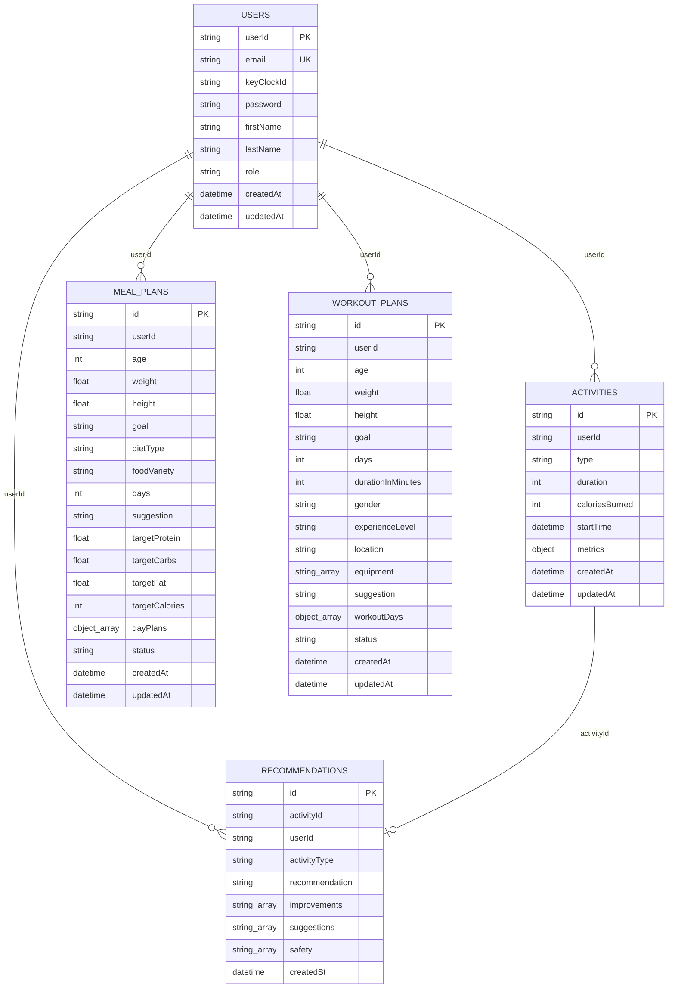
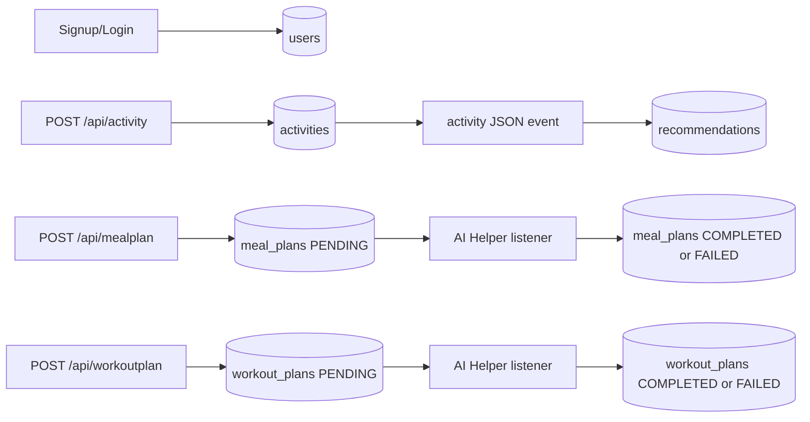

# Database Design

FitTrack uses MySQL for user profiles and MongoDB for activity and AI-generated documents.

## Database ER Diagram

The relationships above are logical relationships inferred from fields. They are not enforced by database foreign keys in the MongoDB collections.

## MySQL Table

### `users`

Defined in `userservice/src/main/java/com/fitness/userservice/Model/User.java`.

| Field | Type in Java | Notes |
| --- | --- | --- |
| `userId` | `String` | JPA primary key generated with `GenerationType.UUID` |
| `email` | `String` | `nullable = false`, `unique = true` |
| `key_clock_id` | `String` | Provider identifier field name; code comments indicate Google `sub` is stored here |
| `password` | `String` | Nullable; stored as plain text in current code |
| `firstName` | `String` | Optional |
| `lastName` | `String` | Optional |
| `role` | `UserRole` | Enum stored as string; default `USER` |
| `createdAt` | `LocalDateTime` | Hibernate `@CreationTimestamp` |
| `updatedAt` | `LocalDateTime` | Hibernate `@UpdateTimestamp` |

Indexes:

- Primary key on `userId`.
- Unique constraint on `email`.
- No explicit index is declared for `key_clock_id`.

## MongoDB Collections

### `activities`

Defined in `activity-status/src/main/java/com/fitness/activitystatus/Model/Activity.java`.

| Field | Notes |
| --- | --- |
| `id` | Mongo document ID |
| `userId` | Owner ID |
| `type` | Enum `RUNNING`, `CYCLING`, `CARDIO`, `WEIGHTLIFTING`, `JUMPING` if matching `ActivityType` |
| `duration` | Integer duration |
| `caloriesBurned` | Integer calories |
| `startTime` | Activity start time |
| `metrics` | Stored from `additionalMetrics` through `@Field("metrics")` |
| `createdAt`, `updatedAt` | Spring Data auditing annotations are present |

Query methods:

- `findByuserId(String userId)`.

### `recommendations`

Defined in `aiservice/src/main/java/com/fitness/aiservice/model/Recommendation.java`.

Query methods:

- `findByUserId(String userId)`.
- `findByActivityId(String activityId)`.

### `meal_plans`

Defined in `Aihelper/src/main/java/com/fitness/aihelper/model/MealPlan.java`.

The document snapshots the original request fields and stores generated `dayPlans`. Status values are `PENDING`, `COMPLETED`, and `FAILED`.

Query methods:

- `findByUserId(String userId)`.

### `workout_plans`

Defined in `Aihelper/src/main/java/com/fitness/aihelper/model/WorkoutPlan.java`.

The document snapshots the original workout generation request and stores generated `workoutDays`. Status values are `PENDING`, `COMPLETED`, and `FAILED`.

Query methods:

- `findByUserId(String userId)`.

## Data Flow

## Known Database Gaps

- MongoDB indexes are not explicitly declared in code.
- No schema migration tool such as Flyway or Liquibase is present.
- MySQL schema creation is delegated to Hibernate with `ddl-auto: update`.
- Passwords are not hashed in the current user service implementation.
