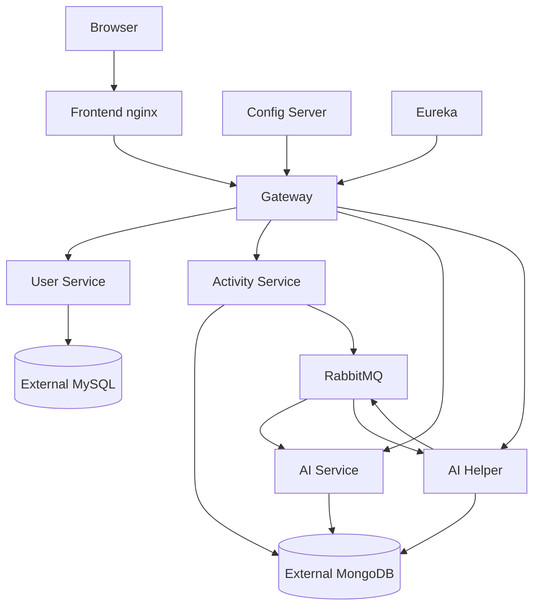

# Deployment Guide

This repository supports three deployment styles: manual local services, Docker Compose, and Kubernetes manifests.

## Deployment Architecture



## Manual Deployment Order

1. Start RabbitMQ.
2. Start Eureka.
3. Start Config Server.
4. Start User Service.
5. Start Activity Service.
6. Start AI Service.
7. Start AI Helper.
8. Start Gateway.
9. Start Frontend.

The order matters because most services import configuration from Config Server, register with Eureka, or depend on RabbitMQ.

## Docker Compose

Use Compose for the quickest full-stack deployment:

```bash
docker compose up -d
```

The checked-in Compose file uses prebuilt Docker Hub images under `2201920100047/*` and publishes only the frontend on host port `80`.

## Kubernetes

Use manifests under `kubernetes/`:

```bash
kubectl apply -f kubernetes/00-namespace.yaml
kubectl apply -f kubernetes/01-secrets.example.yaml
kubectl apply -f kubernetes/
```

Before production use, replace `01-secrets.example.yaml` with real Kubernetes Secrets and avoid committing real values.

## Cloud Scripts

| Script | Purpose |
| --- | --- |
| `deploy.sh` | Ubuntu/Oracle Cloud style setup script that installs Docker, validates `.env`, and starts Compose |
| `ec2-setup.sh` | Amazon Linux 2023 bootstrap script with Docker, Docker Compose, and swap setup |
| `build-push.sh` | Builds and pushes service images to Docker Hub user `2201920100047` |

The repository references `.env.example` in scripts, but no root `.env.example` file is present in the file listing inspected for this documentation.

## Production Readiness Checklist

- Rotate all credentials that appear in checked-in YAML files.
- Add a root `.env.example`.
- Configure TLS at ingress or a reverse proxy.
- Set `cookie-secure: true` for HTTPS.
- Use strong `APP_JWT_SECRET` values across all gateway replicas.
- Add persistent and backup-managed database services.
- Add CI/CD for image build, test, and deploy.
