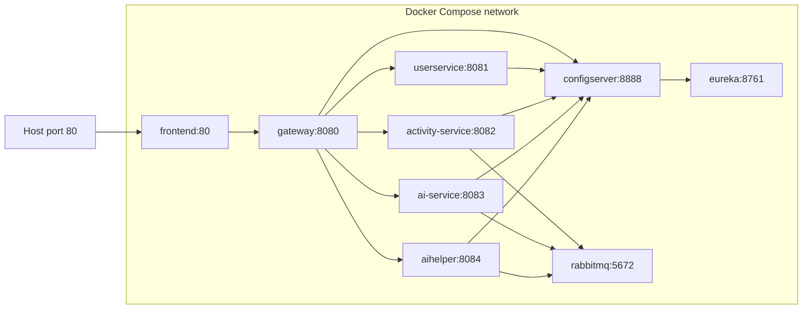

# Docker

## Docker Architecture

## Services

| Service | Image | Internal port | Published port | Health check |
| --- | --- | --- | --- | --- |
| `rabbitmq` | `rabbitmq:3-management-alpine` | `5672` | Not published | `rabbitmq-diagnostics check_running` |
| `eureka` | `2201920100047/eureka:latest` | `8761` | Not published | `GET /` |
| `configserver` | `2201920100047/configserver:latest` | `8888` | Not published | `GET /actuator/health` |
| `userservice` | `2201920100047/userservice:latest` | `8081` | Not published | `GET /actuator/health` |
| `activity-service` | `2201920100047/activity-status:latest` | `8082` | Not published | `GET /actuator/health` |
| `ai-service` | `2201920100047/aiservice:latest` | `8083` | Not published | `GET /actuator/health` |
| `aihelper` | `2201920100047/aihelper:latest` | `8084` | Not published | `GET /actuator/health` |
| `gateway` | `2201920100047/gateway:latest` | `8080` | Not published | `GET /actuator/health` |
| `frontend` | `2201920100047/frontend:latest` | `80` | `80:80` | None in Compose |

## Startup Order

Compose `depends_on` with health conditions is configured as:

1. RabbitMQ and Eureka.
2. Config Server after Eureka.
3. User Service after Config Server.
4. Activity, AI, and AI Helper after Config Server and RabbitMQ.
5. Gateway after Eureka, Config Server, User Service, Activity Service, AI Helper, and AI Service.
6. Frontend after Gateway.

## Networks And Volumes

Compose uses Docker Compose's default project network. No named volumes are declared in the checked-in `docker-compose.yml`. Databases are external because the Compose file does not run MySQL or MongoDB containers.

## Resource Limits

The Compose file sets memory limits designed for low-memory deployments:

- Frontend: `50M`.
- RabbitMQ: `128M`.
- Eureka and Config Server: `200M`.
- Gateway, Activity, AI, and AI Helper: approximately `240M`.
- User Service: `280M`.

## Frontend nginx Proxy

`frontend/nginx.conf` serves the SPA and proxies `/api/` to `http://gateway:8080` using Docker's embedded DNS resolver `127.0.0.11`.
