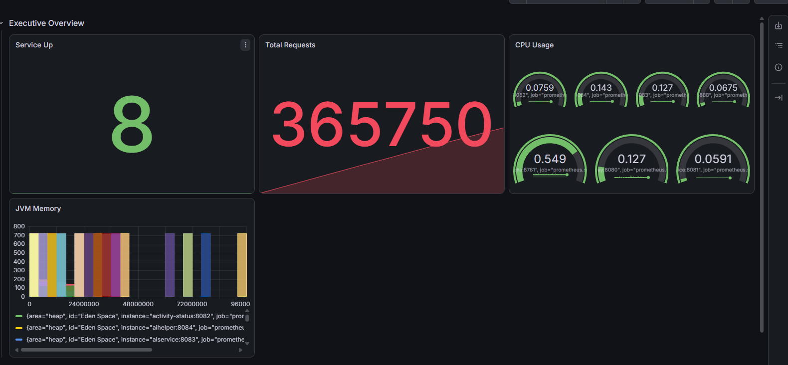
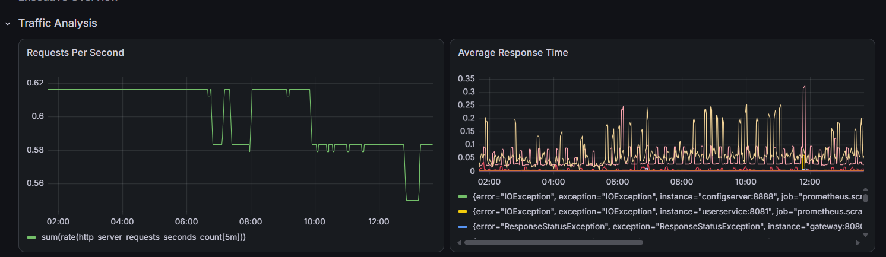
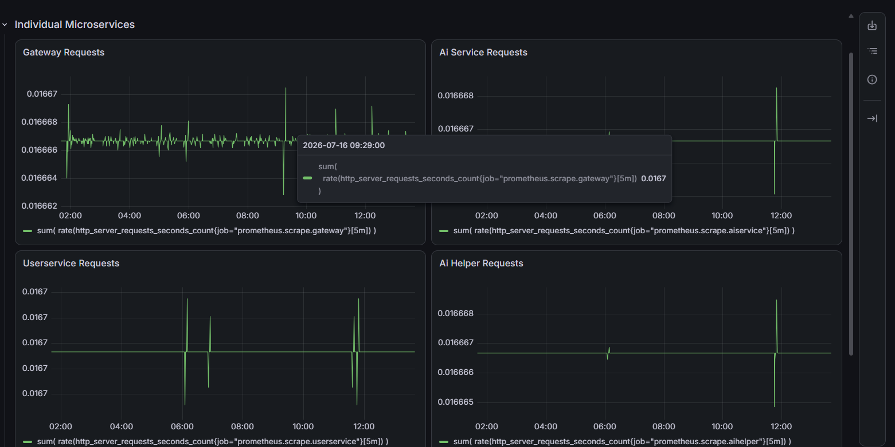
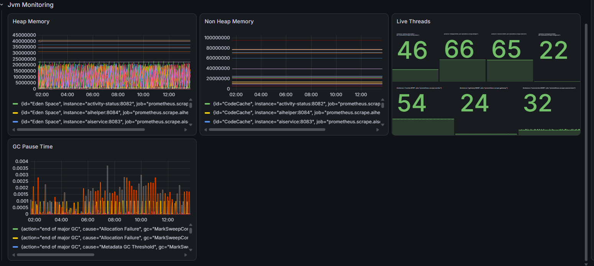

# Grafana Monitoring

This page documents the Grafana dashboard screenshots captured for the running FitTrack microservices stack.

## Dashboard Overview

The captured Grafana dashboard shows service availability, request volume, CPU usage, JVM memory, traffic behavior, per-service request rates, thread counts, and garbage collection pause time.

| Dashboard Section | What It Shows |
| --- | --- |
| Executive Overview | Service count, total request volume, CPU gauges, and JVM memory |
| Traffic Analysis | Requests per second and average response time |
| Individual Microservices | Request rate panels for gateway, AI service, user service, and AI helper |
| JVM Monitoring | Heap memory, non-heap memory, live threads, and GC pause time |

## Executive Overview

The executive overview screenshot shows the high-level service health and throughput panels. The visible dashboard includes `Service Up`, `Total Requests`, `CPU Usage`, and `JVM Memory` panels.

## Traffic Analysis

The traffic analysis screenshot shows request rate and response-time behavior across the monitored services. The panels visible in the screenshot are `Requests Per Second` and `Average Response Time`.

## Individual Microservices

The individual microservices screenshot shows request-rate panels for specific services. Visible panels include `Gateway Requests`, `Ai Service Requests`, `Userservice Requests`, and `Ai Helper Requests`.

## JVM Monitoring

The JVM monitoring screenshot shows Java runtime metrics across the Spring services. Visible panels include `Heap Memory`, `Non Heap Memory`, `Live Threads`, and `GC Pause Time`.

## Notes From The Repository

- The screenshots show Grafana panels using Prometheus-style metric names such as `http_server_requests_seconds_count`.
- The documentation repository does not currently include Grafana dashboard JSON, Prometheus configuration, or Docker/Kubernetes manifests for Grafana and Prometheus.
- Because those monitoring configuration files are not present in the repository, this page documents the screenshots only and does not claim a reproducible monitoring stack from the checked-in files.
