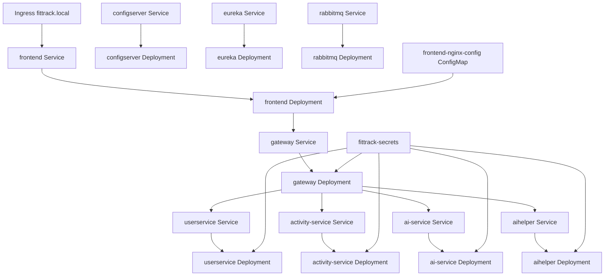

# Kubernetes

Kubernetes manifests live in `kubernetes/` and target namespace `fittrack`.

## Kubernetes Architecture



## Manifest Inventory

| File | Resource |
| --- | --- |
| `00-namespace.yaml` | Namespace `fittrack` |
| `01-secrets.example.yaml` | Example Secret `fittrack-secrets` |
| `02-configmap-nginx.yaml` | ConfigMap `frontend-nginx-config` |
| `03-rabbitmq.yaml` | RabbitMQ Deployment and Service |
| `04-eureka.yaml` | Eureka Deployment and Service |
| `05-configserver.yaml` | Config Server Deployment and Service |
| `06-userservice.yaml` | User Service Deployment and Service |
| `07-activity-service.yaml` | Activity Service Deployment and Service |
| `08-ai-service.yaml` | AI Service Deployment and Service |
| `09-aihelper.yaml` | AI Helper Deployment and Service |
| `10-gateway.yaml` | Gateway Deployment and Service |
| `11-frontend.yaml` | Frontend Deployment and NodePort Service |
| `12-ingress.yaml` | Ingress for `fittrack.local` and default hostless rule |

## Secrets

The example secret lists these keys:

- `SPRING_DATASOURCE_URL`
- `DB_USERNAME`
- `DB_PASSWORD`
- `MONGODB_URI`
- `GOOGLE_CLIENT_ID`
- `GOOGLE_CLIENT_SECRET`
- `APP_JWT_SECRET`
- `GEN_AI_KEY`

Do not apply `01-secrets.example.yaml` unchanged to a real cluster.

## Services And Ports

| Service | Port |
| --- | --- |
| `rabbitmq` | `5672`, `15672` |
| `eureka` | `8761` |
| `configserver` | `8888` |
| `userservice` | `8081` |
| `activity-service` | `8082` |
| `ai-service` | `8083` |
| `aihelper` | `8084` |
| `gateway` | `8080` |
| `frontend` | `80`, NodePort `30080` |

## Persistent Volumes

No Kubernetes PersistentVolume or PersistentVolumeClaim manifest is present. RabbitMQ uses pod-local storage in the current manifests, and MySQL/MongoDB are expected to be external through connection strings.

## Deployment Commands

```bash
kubectl apply -f kubernetes/00-namespace.yaml
kubectl apply -f kubernetes/01-secrets.example.yaml
kubectl apply -f kubernetes/
```

For Minikube ingress:

```bash
minikube addons enable ingress
kubectl apply -f kubernetes/12-ingress.yaml
```

The repository also includes `kubernetes/deploy-minikube.sh` and `kubernetes/deploy-minikube.ps1`.
