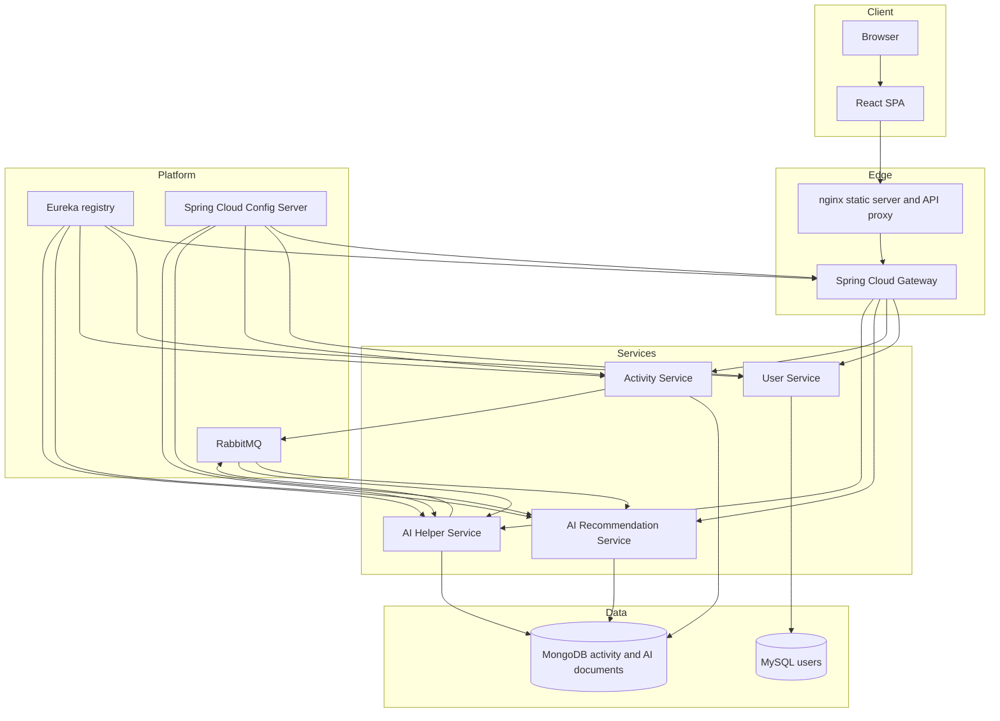
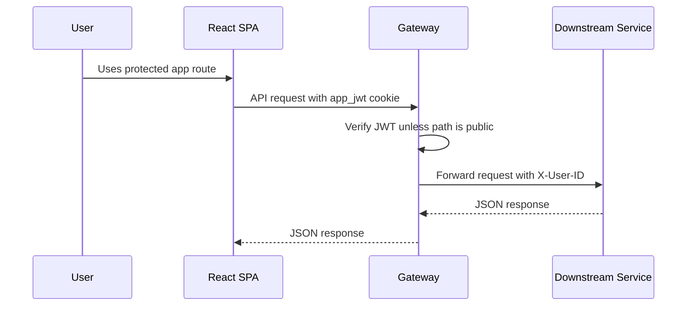

# Project Architecture

FitTrack Microservices is organized around a React SPA, a Spring Cloud Gateway, Spring Boot business services, RabbitMQ, MySQL, MongoDB, Eureka, and a native Spring Cloud Config Server.

## Service Map

| Component | Path | Runtime | Responsibility |
| --- | --- | --- | --- |
| Frontend | `frontend/` | React, Vite, nginx | Browser UI and `/api` proxy in production |
| Gateway | `gateway/` | Spring Cloud Gateway WebFlux | Auth endpoints, JWT cookie, route forwarding, `X-User-ID` injection |
| User Service | `userservice/` | Spring MVC, JPA | User registration, login, lookup, validation |
| Activity Service | `activity-status/` | Spring MVC, MongoDB, RabbitMQ | Activity creation/listing and activity event publishing |
| AI Service | `aiservice/` | Spring MVC, MongoDB, RabbitMQ | Activity recommendation generation and retrieval |
| AI Helper | `Aihelper/` | Spring MVC, MongoDB, RabbitMQ | Meal-plan and workout-plan generation |
| Config Server | `configserver/` | Spring Cloud Config | Native YAML configuration |
| Eureka | `eureka/` | Eureka Server | Service discovery registry |

## Overall Architecture

## Request Flow

## Important Boundaries

- Browser code never reads the app JWT because it is stored as an httpOnly cookie.
- Downstream services trust the `X-User-ID` header after gateway validation.
- User identity is stored in MySQL; activity and generated AI data are stored in MongoDB.
- RabbitMQ decouples activity tracking from recommendation generation and decouples plan requests from plan completion.

## Configuration Source

Each Spring service imports `optional:configserver:http://${CONFIG_HOST:localhost}:8888`. The checked-in native config files live under `configserver/src/main/resources/config/`.

## Known Architecture Gaps

- No API specification file such as OpenAPI is present.
- No centralized observability stack is present.
- No CI workflow is present in the repository.
- Secrets are hardcoded in current config files and should be externalized before production use.
