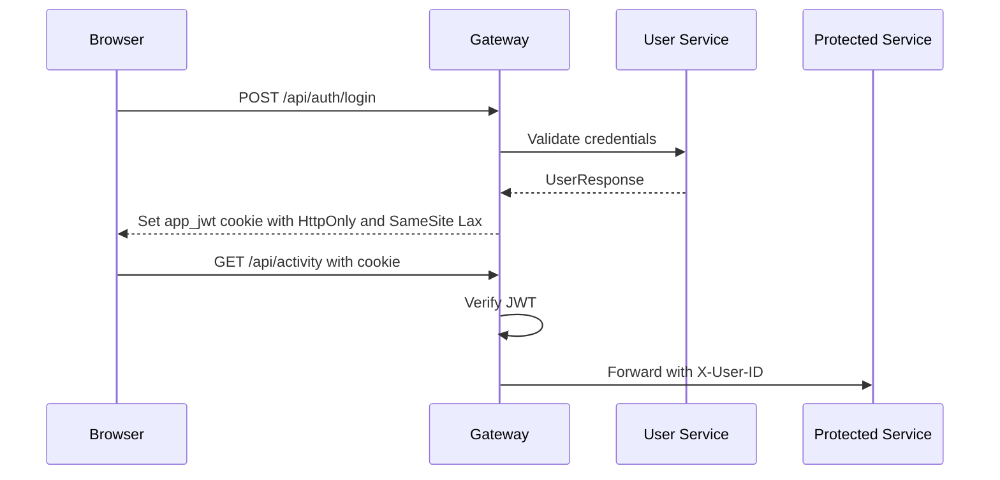

# Security

This document reflects the current implementation in the repository.

## Implemented Security Features

| Feature | Current implementation |
| --- | --- |
| Gateway-owned auth | `gateway/src/main/java/com/fitness/gateway/auth/AuthController.java` |
| App session cookie | Gateway sets an httpOnly cookie named by `app.security.cookie-name` |
| JWT verification | `GatewayAuthFilter` verifies the cookie for non-public paths |
| Downstream identity | Gateway injects `X-User-ID` after validating the app JWT |
| Google login | Gateway verifies Google ID tokens before user upsert |
| CORS | Gateway config reads `CORS_ALLOWED_ORIGINS` with a local/dev fallback list |
| Response hygiene | User API response omits the password field |
| Public paths | Configured as `/api/auth/**,/actuator/**` |

## Authentication Flow

## Current Security Risks

| Risk | Evidence | Recommended remediation |
| --- | --- | --- |
| Hardcoded database and API credentials | Config Server YAML contains MySQL, MongoDB, and Groq values | Rotate exposed credentials and load them from environment variables or secrets |
| Plaintext password storage | `UserService.login` compares raw password strings and `User.password` stores `String password` | Use a password hashing algorithm such as bcrypt/Argon2 through Spring Security |
| Insecure cookie flag in default config | `cookie-secure: false` in gateway config | Set secure cookies to true in HTTPS environments |
| No CSRF protection | CSRF is disabled in `SecurityConfig` | Reassess for cookie-authenticated browser mutations; consider CSRF tokens or same-site constraints |
| No rate limiting | No gateway rate limiter is configured | Add gateway-level throttling for auth and write endpoints |
| No authorization roles on endpoints | Downstream endpoints accept authenticated user context but do not enforce role checks | Add role/ownership checks where needed |
| Secrets example can be applied as real manifest | `01-secrets.example.yaml` is a Kubernetes Secret file with placeholder values | Keep examples out of deploy pipelines; use generated secrets |

## Header Trust Boundary

Downstream services use `X-User-ID`. That header should only be trusted when requests originate from the gateway. In production, prevent direct public access to backend services.

## Logging Notes

The services log some auth and message-processing events. Avoid logging raw credentials, JWTs, Google credentials, or AI provider keys.

## Production Checklist

- Rotate all exposed credentials.
- Add `.env.example` and remove real values from config files.
- Enable HTTPS and set secure cookies.
- Hash passwords before persistence.
- Add dependency vulnerability scanning.
- Restrict backend service network access.
- Add rate limits and request body size limits.
- Add audit logging for auth events.
- Add backup and restore procedures for MySQL and MongoDB.
