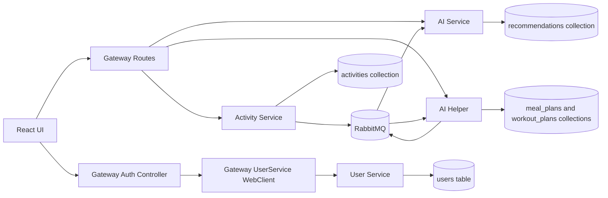
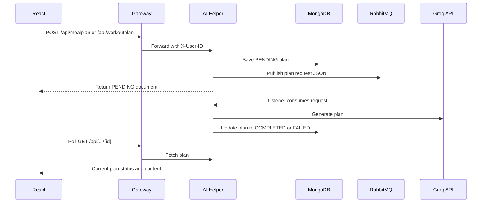

# System Design

## Design Goals

- Keep UI concerns isolated in the React frontend.
- Route all browser API calls through one gateway.
- Separate profile, activity, recommendation, meal-plan, and workout-plan responsibilities.
- Use asynchronous messaging for AI work that may take longer than a normal request.
- Support both containerized and Kubernetes deployment paths.

## Component Diagram



## Authentication Design

```mermaid
sequenceDiagram
  participant UI as React
  participant GW as Gateway
  participant Google as Google Token Verification
  participant User as User Service

  UI->>GW: POST /api/auth/google { credential }
  GW->>Google: Verify Google ID token
  GW->>User: Upsert user by email
  User-->>GW: UserResponse
  GW->>GW: Mint app JWT
  GW-->>UI: Set-Cookie app_jwt; { user }
```

Email signup and login follow the same gateway-to-user-service pattern without Google token verification.

## Async AI Plan Flow



## Error Handling

The services include `GlobalExceptionHandler` classes in user, activity, AI, and AI Helper modules. The exact response envelope varies by service and is not standardized by a shared library.

## Scalability Notes

- The gateway can scale horizontally if all instances share the same JWT signing secret.
- RabbitMQ-backed AI jobs allow request creation to return before AI generation completes.
- MongoDB query methods are based on `userId` and `activityId`; explicit indexes should be added before high-volume production use.
- Docker Compose uses single replicas. Kubernetes manifests also specify one replica per service.
