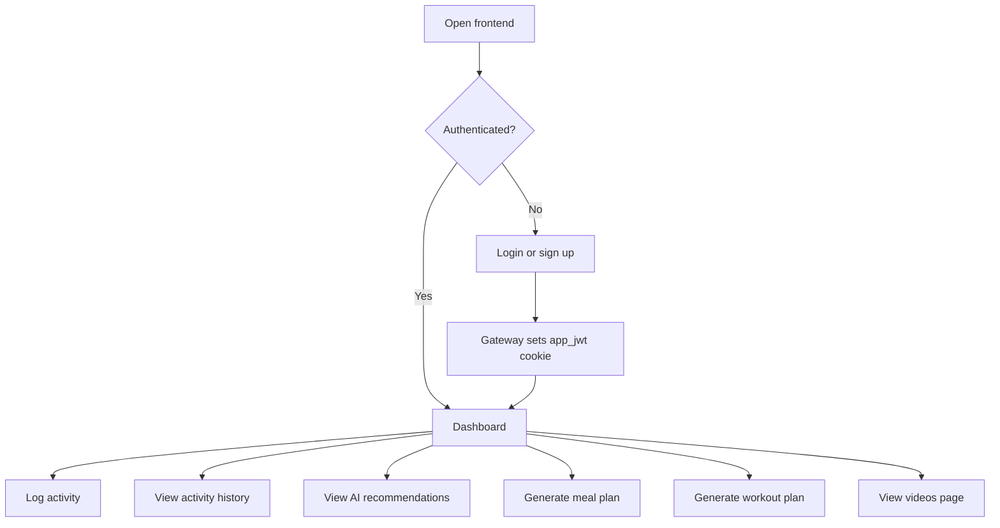
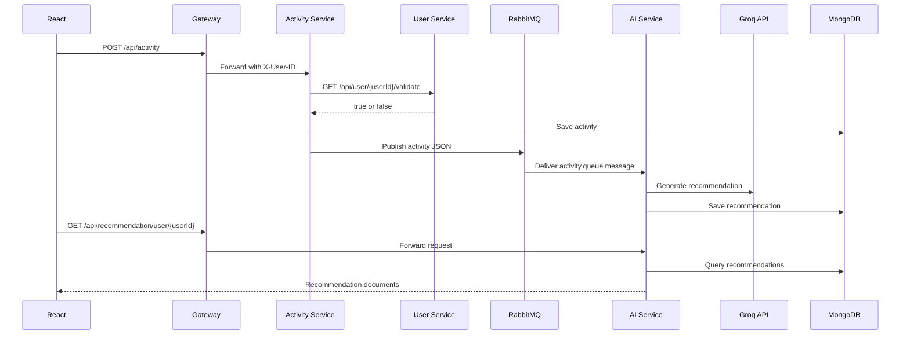
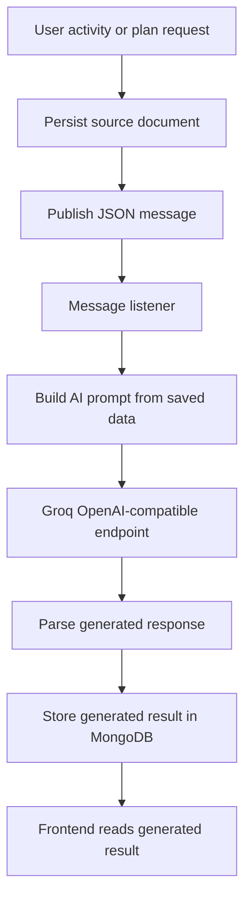

# Workflow

## User Workflow



## Activity And Recommendation Workflow



## Meal Plan Pipeline

```mermaid
flowchart LR
  Request[POST /api/mealplan] --> SavePending[Save meal_plans document as PENDING]
  SavePending --> Publish[Publish to mealplan.exchange]
  Publish --> Queue[mealplan.queue]
  Queue --> Listener[MealPlanMessageListener]
  Listener --> Groq[Groq prompt]
  Groq --> Update[Update document with dayPlans]
  Update --> Status[COMPLETED or FAILED]
  Status --> Poll[Frontend polls GET /api/mealplan/{id}]
```

## Workout Plan Pipeline

```mermaid
flowchart LR
  Request[POST /api/workoutplan] --> SavePending[Save workout_plans document as PENDING]
  SavePending --> Publish[Publish to workoutplan.exchange]
  Publish --> Queue[workoutplan.queue]
  Queue --> Listener[WorkoutPlanMessageListener]
  Listener --> Groq[Groq prompt]
  Groq --> Update[Update document with workoutDays]
  Update --> Status[COMPLETED or FAILED]
  Status --> Poll[Frontend polls GET /api/workoutplan/{id}]
```

## Developer Workflow

1. Run infrastructure services first: RabbitMQ, Eureka, and Config Server.
2. Start backend services in dependency order.
3. Run the frontend with `npm run dev`.
4. Use the gateway URL for API calls.
5. Run k6 smoke tests against a deployed stack when validating availability.

## AI Processing Pipeline



## Documentation Workflow

When adding new backend functionality:

1. Add or update the controller/service/model.
2. Update `docs/API_DOCUMENTATION.md`.
3. Update `docs/DATABASE_DESIGN.md` if persistence changes.
4. Update `docs/DOCKER.md` or `docs/KUBERNETES.md` if deployment behavior changes.
5. Update the README feature list only when the implementation exists.
